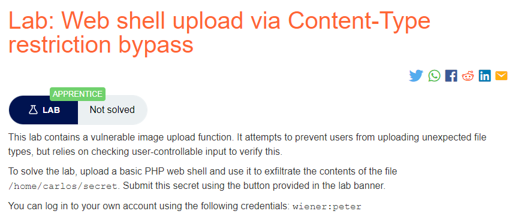
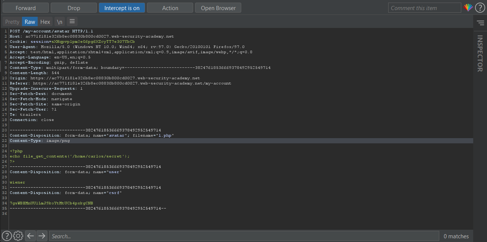

### Mô tả
> này chứa một chức năng tải lên hình ảnh dễ bị tấn công. Nó cố gắng ngăn người dùng tải lên các loại tệp không mong muốn, nhưng dựa vào việc kiểm tra đầu vào do người dùng kiểm soát để xác minh điều này.
> 
> Để giải quyết phòng thí nghiệm, hãy tải lên một web shell PHP cơ bản và sử dụng nó để lọc nội dung của tệp / home / carlos / secret. Gửi bí mật này bằng cách sử dụng nút được cung cấp trong biểu ngữ của Lab.
>
> Bạn có thể đăng nhập vào tài khoản của mình bằng thông tin đăng nhập sau: wiener: peter
### Giải quyết
- Đăng nhập bằng tài khoản được cung cấp từ đề bài, tải lên file shell và bắt request đó bằng BurpSuite.
- Vì trang web chỉ cho phép upload  image/jpeg and image/png => sửa `Content-Type` của request từ `application/octet-stream => image/jpeg hoặc image/png` and Forward

###### Solved!