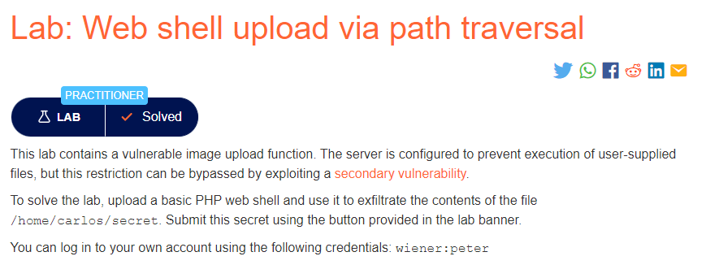
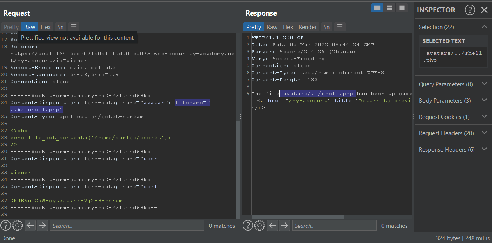

### Mô tả
> Lab này chứa chức năng tải lên hình ảnh dễ bị tổn thương. Máy chủ được cấu hình để ngăn chặn việc thực hiện các tệp do người dùng cung cấp, nhưng hạn chế này có thể được bỏ qua bằng cách khai thác lỗ hổng thứ cấp.
>
> Để giải quyết phòng thí nghiệm, hãy tải lên một vỏ web PHP cơ bản và sử dụng nó để trích xuất nội dung của tệp . Gửi bí mật này bằng cách sử dụng nút được cung cấp trong biểu ngữ phòng thí nghiệm. /home/carlos/secret
>
> Bạn có thể đăng nhập vào tài khoản của riêng mình bằng cách sử dụng các thông tin đăng nhập sau: wiener:peter

### Giải quyết
- Trang web này không cho phép thực thi các tệp được tải lên bởi người dùng tại thư mục chứa file upload cụ thể ở đây là thư mục `avatars`. Vì vậy chỉ có thể thực thi file web shell trong thư mục trước đó là `files` vì nó không bị hạn chế quyền thực thi.
- Để có thể upload file vào thư mục `files`, trong BurpSuite, tại `Content-Disposition` thay đổi `filename` thành `../shell.php` và forward.
- Sau đó phản hồi cho biết `The file avatars/shell.php has been uploaded`. Điều này gợi ý rằng máy chủ đang loại bỏ trình tự truyền tải thư mục khỏi tên tệp (stripping the directory traversal sequence from the file name).
- Để vượt qua điều này, encode url ký tự "/" => "%2f", sau đó upload lại file, bắt request bằng BurpSuite thay đổi filename => "..%2fshell.php" và forward.
- Phản hồi trả về `The file avatars/../shell.php has been uploaded` là thành công.
- Mở file tải lên lấy chuỗi ký tự và nhập vào Submit solution.

###### Solved!