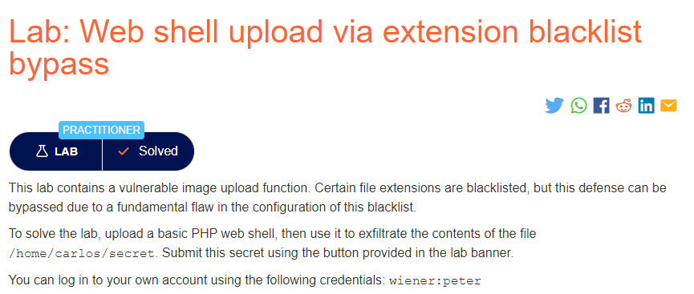
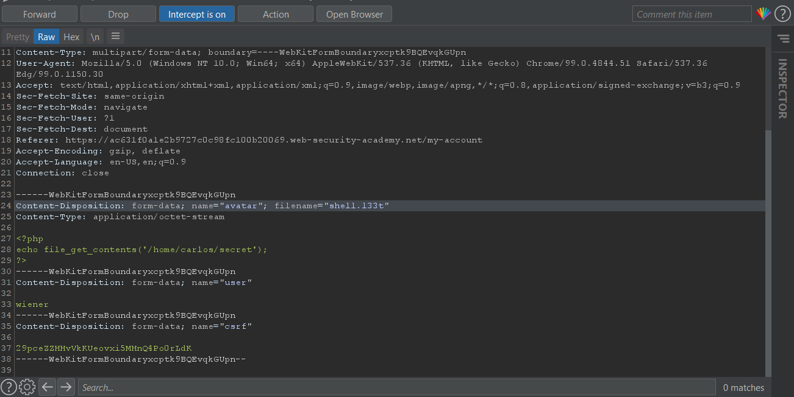

### Mô tả
> Lab này chứa một chức năng tải lên hình ảnh dễ bị tấn công. Một số phần mở rộng tệp nhất định được đưa vào danh sách đen, nhưng biện pháp bảo vệ này có thể bị bỏ qua do một lỗ hổng cơ bản trong cấu hình của danh sách đen này.
>
> Để giải quyết phòng thí nghiệm, hãy tải lên một web shell PHP cơ bản, sau đó sử dụng nó để lọc nội dung của tệp / home / carlos / secret. Gửi bí mật này bằng cách sử dụng nút được cung cấp trong biểu ngữ phòng thí nghiệm.
>
> Bạn có thể đăng nhập vào tài khoản của mình bằng thông tin đăng nhập sau: wiener: peter
### Giải quyết
- Trang web đã liệt kê những đuôi file có thể gây nguy hại vào blacklist ví dụ như: `.php, .pHp, .Php, .phP, .pht, .phtml, .php3, .php4, .php5, .php6, .inc, ... `
- Theo như mô tả, trang web chứa lỗ hổng cơ bản trong cấu hình => khai thác tệp cấu hình .htaccess
- Upload file cấu hình .htaccess lên với nội dung: `AddType application/x-httpd-php .l33t`
- Sau đó tải lên file php, bắt request qua BurpSuite, đổi đuôi file thành `l33t` và forward.
- Mở file tải lên lấy chuỗi ký tự và nhập vào Submit solution.

###### Solved!
