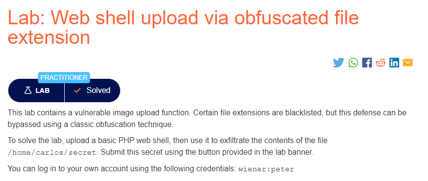
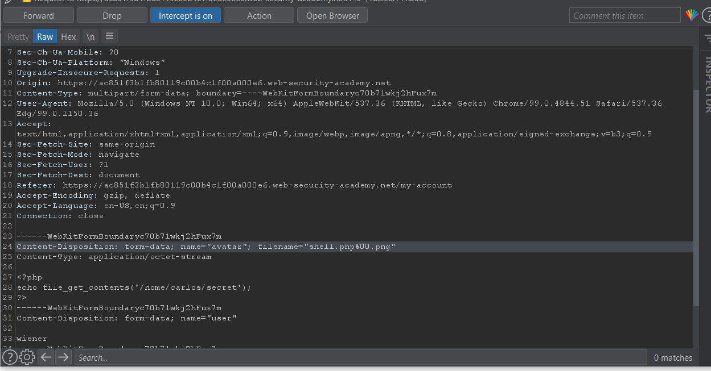

### Mô tả
> Lab này chứa một chức năng tải lên hình ảnh dễ bị tấn công. Một số phần mở rộng tệp nhất định được đưa vào danh sách đen, nhưng biện pháp bảo vệ này có thể được bỏ qua bằng cách sử dụng kỹ thuật làm xáo trộn cổ điển.
>
> Để giải quyết phòng thí nghiệm, hãy tải lên một web shell PHP cơ bản, sau đó sử dụng nó để lọc nội dung của tệp / home / carlos / secret. Gửi bí mật này bằng cách sử dụng nút được cung cấp trong biểu ngữ phòng thí nghiệm.
>
> Bạn có thể đăng nhập vào tài khoản của mình bằng thông tin đăng nhập sau: wiener: peter

### Giải quyết
- Theo như mô tả, một số phần mở rộng tệp nhất định được đưa vào danh sách đen và khi upload php file thông báo trả về: `Sorry, only JPG & PNG files are allowed Sorry, there was an error uploading your file.`. Tức là chỉ có  thể upload file .png và .jpg hay nói cách khác trang web này sử dụng whitelist chỉ cho phép tải lên tệp png và jpg.
- Và để có thể bypass whilelist ở lab này mình có thể sử dụng double extension kết hợp với null byte.
- Bắt request upload file php, thay đổi tên file như ở đây là: `shell.php` => `shell.php%00.png` và forward.

- Cuối cùng, truy cập vào đường dẫn files/avatars/shell.php để sử dụng file php vừa upload, lấy chuỗi ký tự nhận được và nhập vào Submit solution.
###### Solved!

